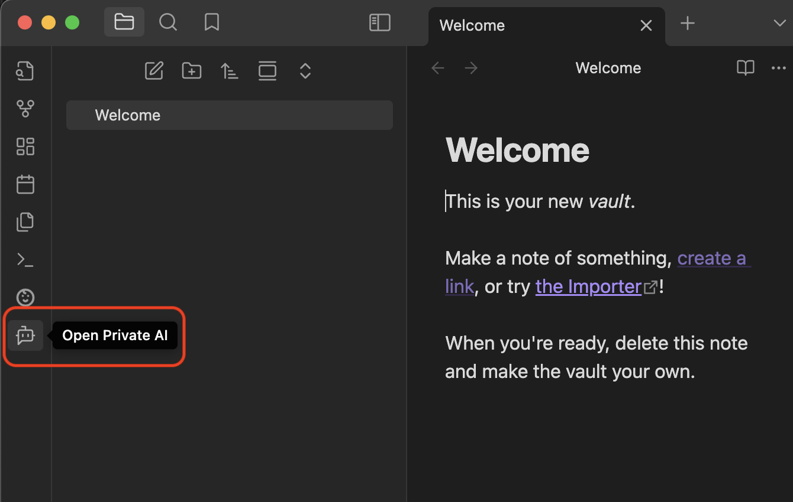

# Private AI Beta Test Quickstart Guide

⚠️ The Private AI plugin is awaiting review by the Obsidian product team. As a result, we have to use this method to sideload the beta test build.

## Step 1: Install BRAT to Allow Sideloading an Unpublished Plugin

1. Open **Obsidian** and go to **Settings**
2. Click **Community Plugins**
3. Turn on **Community Plugins** if it's not already enabled
4. Click **Browse** and search for **BRAT**
5. Click **Install**
6. Click **Enable** to turn on the plugin
7. Click **Options**

## Step 2: Install the Private AI Plugin

1. Under the **Beta plugin list** section, click **Add beta plugin**
2. In the **GitHub repository for beta plugin** textbox, paste the following URL:  
   `https://github.com/gabosgab/ObsidianPrivateAI`
3. In the **Version** dropdown, select **Latest Version**
4. Ensure **Enable plugin after install** is checked
5. Click **Add Plugin**

## Step 3: Open the Private AI Tab

1. Click the **Bot Chat Bubble** icon on the left-hand side

## Step 4: Finish Setup

Follow the in-window prompt to download and install the local model.

