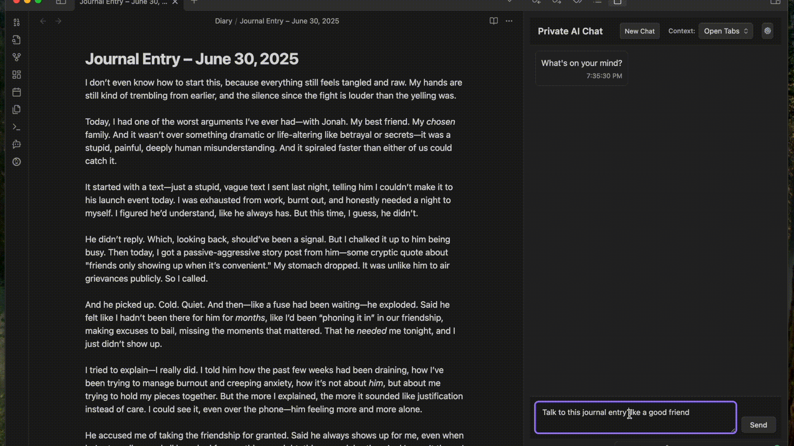
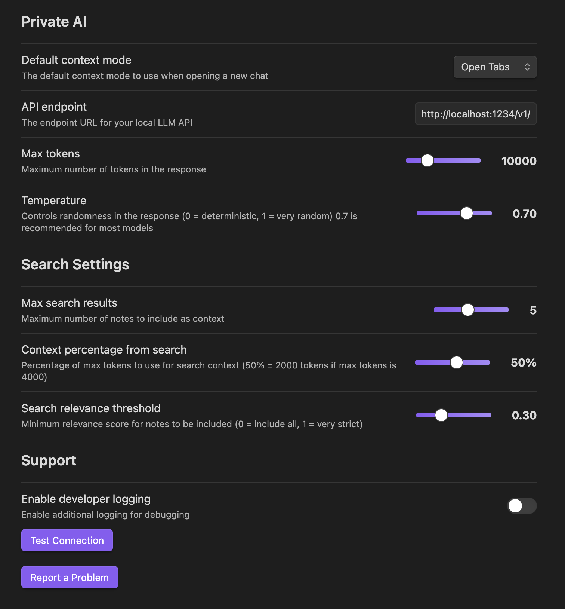

# Private AI Chat for Obsidian

Effortlessly chat with your notes using locally hosted AI.  Private by design, your notes never leave the device and use locally processing only.

## Features

- **Easy Setup**: Easy setup and model swapping with LM Studio
- **Cross Platform**: Supports for most modern Mac and Windows machines
- **Integrated Vault Search**: Automatically search your Obsidian vault for relevant information to provide contextual responses and cite specific notes from your vault
- **Open Tab Context**: Focus your conversation on specific notes for focused insights
- **Performance Tuning**: Customize models, search parameters, token limits, and more to tune performance for your hardware

## Example Queries

- "I have to have a difficult conversation with a friend, read my journal entry about the situation and help me come up with a good way to talk to my friend compassionately"
- "My partner was a jerk to me, help me look at other alternative reasons why they may have reacted the way they did"
- "Talk to this journal entry like a good friend"
- "When did I first meet Jacob?"
- "What did frank talk about at our meeting on Obsidian plugins?"
- "What did I write about machine learning?"
- "What are my thoughts on productivity systems?"

## Getting Started + Setup

⚠️ *We're pending review by the Obsidian plugin review team, in the meantime, you can use our beta test quickstart guide to install and provide feedback.*

📃 [Beta Test Quickstart Guide](GettingStarted.md)

## Development

### Contributing

Contributions are welcome! Please feel free to submit issues and pull requests.

### Attributions

This project respects and is compatible with the original licenses of all code and dependencies used:

### Development Tools
- **[esbuild](https://esbuild.github.io/)** - MIT License - Used for bundling the plugin
- **[TypeScript](https://www.typescriptlang.org/)** - Apache-2.0 License - Used for type safety
- **[Obsidian API](https://github.com/obsidianmd/obsidian-api)** - MIT License - Official Obsidian plugin API

### Dependencies
All development dependencies are used under their respective open-source licenses (MIT, Apache-2.0, ISC, BSD) and are properly externalized in the build process.

### Third-Party Services
This plugin integrates with local LLM services but does not include any of their code:
- **[LM Studio](https://lmstudio.ai/)** - Proprietary - Local LLM interface

### License

This project is licensed under the [MIT License](LICENSE.md).
